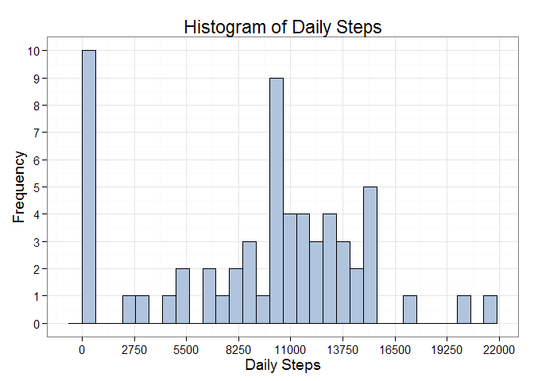

# Reproducible Research: Peer Assignment 1


***
## Loading and preprocessing the data

Show any code that is needed to:

1. Load the data (i.e. read.csv()), 

2. Process/transform the data (if necessary) into a format suitable for your 
analysis.

For this assignment, the working directory will contain this script. The data 
source 'activity.csv' will be downloaded and un-zipped into the working 
directory if it does not already exist. 'read.csv' (or read.table) defaults are 
okay.


```r
if (!(file.exists("activity.csv"))) {
    message("Getting your data from the internet.")
    archiveUrl <- "https://d396qusza40orc.cloudfront.net/repdata%2Fdata%2Factivity.zip"
    archiveFile <- basename(URLdecode(archiveUrl))
    filePath <- file.path(getwd(), archiveFile)
    download.file(url = archiveUrl, destfile = filePath, method = "curl")
    if (file.exists(archiveFile)) {
        archiveIndex <- unzip(archiveFile)
    }
}

message("Reading 'activity.csv' into data frame.")
```

```
## Reading 'activity.csv' into data frame.
```

```r
df <- read.csv("activity.csv", header=TRUE)
```


#### OPTIONAL CODE AND NOTES ON DATES AND TIMES:

You might want to consider adding these two code chunks (below) to the loading 
and processing of data, though they are presented here as 'options' and are not 
included in this program.


```r
# Optional:
message("Seting up datetime field.")  
df$datetime = as.POSIXct(paste(df$date, sprintf("%04d",df$interval)), format="%Y-%m-%d%H%M")
```

To extract the 'hour' and 'minute' from the POSIXct field 'datetime' as a 'pretty' 
character strings that can be grouped and used for plotting tick marks use a piece 
of code like this: (The 'paste' and the 'format' functions come from the R {base} 
package which is typically loaded by default.)


```r
# Optional:
paste(format(h$datetime,"%H"),format(h$datetime,"%M"),sep=":")
```

To extract the 'weekdays' from the POSIXct field 'datetime' (so the data can be 
grouped by weekdays versus weekends) use forms the 'weekdays' or 'wdays' functions 
that are in the R {lubridate} package. We will check for its presences and load 
the package as necessary. Note: that 'lubridate' has a 'ymd' function that can 
convert a character string into a POSIX date, obviating the need for datetime.


```r
if (!("lubridate" %in% installed.packages())) {
    message("One moment... need to install \"lubridate\" package.")
    install.packages("lubridate", quiet = TRUE)
}    

if (!("lubridate" %in% loadedNamespaces())) {
    message("One moment... loading \"lubridate\" library.")
    library(lubridate, quietly = TRUE)
}
```

```
## One moment... loading "lubridate" library.
```


***
## What is mean total number of steps taken per day?

For this part of the assignment, you can ignore the missing values in the dataset.

1. Make a histogram of the total number of steps taken each day.

2. Calculate and report the mean and median total number of steps taken per day.

We will use the 'dplyr' package wherever we can make our data manipulations 
faster and more efficient by using the 'dplyr' piping of interim results.


```r
if (!("dplyr" %in% installed.packages())) {
    message("One moment... need to install \"dplyr\" package.")
    install.packages("dplyr", quiet = TRUE)
}    

if (!("dplyr" %in% loadedNamespaces())) {
    message("One moment... loading \"dplyr\" library.")
    library(dplyr, quietly = TRUE)
}
```

```
## One moment... loading "dplyr" library.
## 
## Attaching package: 'dplyr'
## 
## The following objects are masked from 'package:lubridate':
## 
##     intersect, setdiff, union
## 
## The following object is masked from 'package:stats':
## 
##     filter
## 
## The following objects are masked from 'package:base':
## 
##     intersect, setdiff, setequal, union
```

GROUP_BY 'date' and SUMMARIZE (sum) 'steps'; change the resulting 'list' to a 
'data.frame' so ggplot can better digest the object.


```r
g <- df %>%
        group_by(date) %>%
            summarize(steps = sum(steps, na.rm=TRUE)) %>%
                data.frame()
```

We will use 'ggplot2' as our preferred plotting engine; however, any equally 
efficient methods (such as those in the 'graphics' package) will be used.


```r
if (!("ggplot2" %in% installed.packages())) {
    message("One moment... need to install \"ggplot2\" package.")
    install.packages("ggplot2", quiet = TRUE)
}
    
if (!("ggplot2" %in% loadedNamespaces())) {
    message("One moment... loading \"ggplot2\" library.")
    library(ggplot2, quietly = TRUE)
}
```

```
## One moment... loading "ggplot2" library.
```

```r
message("Plotting the frequency of daily steps taken during the 61 day period.")
```

```
## Plotting the frequency of daily steps taken during the 61 day period.
```

```r
print(
    ggplot(g) +
        geom_histogram(aes(x=steps),
                       col="black",
                       fill="lightsteelblue",
                       binwidth=diff(range(g$steps))/30) +
        scale_x_continuous(breaks=seq(0,22000,by=2750)) +
        scale_y_continuous(breaks=seq(0,10,by=1)) +
        theme_bw(base_size=14,base_family="sans") +
        labs(x="Daily Steps") +
        labs(y="Frequency") +
        labs(title="Histogram of Daily Steps") +
        theme(plot.title = element_text(size = rel(1.25)))
)
```

 

Report mean and median of distribution inside of message.


```r
message(sprintf("For the distribution \"Daily Steps\" 
    the mean is: %.0f, and the median is: %.0f", mean(g$steps), median(g$steps)))
```

```
## For the distribution "Daily Steps" 
##     the mean is: 9354, and the median is: 10395
```


***
## What is the average daily activity pattern?

1. Make a time series plot (i.e. type = "l") of the 5-minute interval (x-axis) 
and the average number of steps taken, averaged across all days (y-axis).

2. Which 5-minute interval, on average across all the days in the dataset, 
contains the maximum number of steps?

GROUP_BY 'interval' and SUMMARIZE (mean) 'steps'; change the resulting 'list' to 
a 'data.frame' (optional) so ggplot can better digest the object.


```r
h <- df %>%
        group_by(time = interval) %>%
            summarize(average = mean(steps, na.rm = TRUE))

message("Plotting the average daily activity in 5-minute intervals.")
```

```
## Plotting the average daily activity in 5-minute intervals.
```

```r
print(
    ggplot(data = h, aes(x = time, y = average)) +
        geom_line(color = "black", size = 0.5) +
        scale_x_continuous(breaks=seq(0,2400,by=300)) +
        scale_y_continuous(breaks=seq(0,200,by=25)) +
        theme_bw(base_size=14,base_family="sans") +
        labs(x="Time of Day") +
        labs(y="Mean Number of Steps") +
        labs(title="Average Daily Activity Pattern") +
        theme(plot.title = element_text(size = rel(1.25)))
)
```

 

**Note:** Add 'geom_area(fill = "lightsteelblue") +' (following geom_line) in the 
above ggplot code block to fill the area under the line segment.


```r
message(sprintf("For the distribution \"Average Daily Activity Pattern\" 
    the largest averge number of steps in a 5-minute interval is: %.0f", 
    which.max(h$average)))
```

```
## For the distribution "Average Daily Activity Pattern" 
##     the largest averge number of steps in a 5-minute interval is: 104
```


***
## Imputing missing values

Note that there are a number of days/intervals where there are missing values 
(coded as NA). The presence of missing days may introduce bias into some 
calculations or summaries of the data.

1. Calculate and report the total number of missing values in the dataset 
(i.e. the total number of rows with NAs)

2. Devise a strategy for filling in all of the missing values in the dataset. 
The strategy does not need to be sophisticated. For example, you could use the 
mean/median for that day, or the mean for that 5-minute interval, etc.

3. Create a new dataset that is equal to the original dataset but with the 
missing data filled in.

4. Make a histogram of the total number of steps taken each day and Calculate 
and report the mean and median total number of steps taken per day. Do these 
values differ from the estimates from the first part of the assignment? What is 
the impact of imputing missing data on the estimates of the total daily number 
of steps?


```r
message(sprintf("The number of missing (i.e. NA) values in the 
    data set are: %.0f", sum(is.na(df$steps))))
```

```
## The number of missing (i.e. NA) values in the 
##     data set are: 2304
```

Make a copy of the original data frame 'df'. Use 'mapply' from the R {base} 
package to apply an anonymous fuction to each row of the copy. Use the 'h' 
data frame we created when calculated the average daily activity. Use the interval 
average of all days in the data set as a replacement value of the NA's. Note: we 
will not 'round' the replacement values -- the result of which is a change to the 
datatype for 'steps'. This doesn't matter for our plotting and reporting since our 
'h' object (used in the prior step) is also of type 'num' for the steps value.


```r
ddf <- df

message(sprintf("The number of missing (i.e. NA) values in the \"revised\" 
    data set are: %.0f", sum(is.na(ddf$steps))))
```

```
## The number of missing (i.e. NA) values in the "revised" 
##     data set are: 2304
```

```r
ddf$steps <- mapply(function(x,y){ if(is.na(x)){ return(h$average[h$time==y])
                    } else { return(c(x))} }, df$steps, df$interval)

message(sprintf("The number of missing (i.e. NA) values in the \"revised\" 
    data set (post-replacment) are: %.0f", sum(is.na(ddf$steps))))
```

```
## The number of missing (i.e. NA) values in the "revised" 
##     data set (post-replacment) are: 0
```

Repeat the code block from 'g' above, applied to the revised dataset. GROUP_BY 
'date' and SUMMARIZE (sum) 'steps'; change the resulting 'list' to a 'data.frame' 
so ggplot can better digest the object.


```r
i <- ddf %>%
        group_by(date) %>%
            summarize(steps = sum(steps, na.rm=TRUE)) %>%
                data.frame()

message("Plotting the \"revised\" frequency of daily steps taken during the 
    61 day period.")
```

```
## Plotting the "revised" frequency of daily steps taken during the 
##     61 day period.
```

```r
print(
    ggplot(i) +
        geom_histogram(aes(x=steps),
                       col="black",
                       fill="lightsteelblue",
                       binwidth=diff(range(i$steps))/30) +
        scale_x_continuous(breaks=seq(0,22000,by=2750)) +
        scale_y_continuous(breaks=seq(0,12,by=1)) +
        theme_bw(base_size=14,base_family="sans") +
        labs(x="Daily Steps") +
        labs(y="Frequency") +
        labs(title="(Revised) Histogram of Daily Steps") +
        theme(plot.title = element_text(size = rel(1.25)))
)
```

 

Report mean and median of distribution inside of message.


```r
message(sprintf("For the \"revised\" distribution \"Daily Steps\" 
    the mean is: %.0f, and the median is: %.0f", mean(i$steps), median(i$steps)))
```

```
## For the "revised" distribution "Daily Steps" 
##     the mean is: 10766, and the median is: 10766
```


***
## Are there differences in activity patterns between weekdays and weekends?

Add a new 'factor' for 'Weekday' versus 'Weekend' whose underlying levels are 
lubridate values returned by 'wday' (1:7) where Sunday = 1 and Saturday = 7. 
Note: We don't need to convert our 'date' factor to a POSIX compliant date since 
the lubridate 'ymd' function will do this in a construct like this: 
wday(ymd(date)). You can verify this with the construct: weekdays(ymd(date)).


```r
ddf <- ddf %>%
        mutate(day = factor(ifelse(wday(ymd(date)) %in% c(1,7), 
               "Weekend", "Weekday")))
```

Now make a double-panel time series graph of the dataset such that one panel 
shows activity levels for weekdays and the other for weekends. Repeat the code 
block from 'h' above, applied to the revised dataset. GROUP_BY 'date' and the 
factor 'day', then SUMMARIZE (mean) 'steps'; change the resulting 'list' to a 
'data.frame' so ggplot can better digest the object.


```r
j <- ddf %>%
        group_by(day, time = interval) %>%
            summarize(average = mean(steps, na.rm = TRUE)) %>%
                data.frame()
print(
    ggplot(data = j, aes(x = time, y = average)) +
        geom_line(color = "black", size = 0.5) +
        facet_grid(day ~ .) +
        labs(x = "Time of Day") +
        labs(y = "Mean Number of Steps") +
        labs(title = "(Revised) Average Daily Activity Pattern \n Weekdays versus Weekends") +
        theme(plot.title = element_text(hjust = 0.5)) +
        theme_bw(base_size=14,base_family="sans") +
        theme(plot.title = element_text(size = rel(1.25))) +
        scale_x_continuous(breaks=seq(0,2400,by=300))
)
```

 


***
## Conclusions

Clearly, this individual peaks in the morning hours on both 'weekdays' and 
'weekends'. However, there is a consistently higher level of activity throughout
the 'weekend' in the time frame where this individual is 'more' quiescent, 
probably due to home, work, and/or school obligations. We don't know what type 
of individual recorded these observations, but we can infer from the analysis 
that he/she has much more free time on the weekends for their activities. We 
might also infer that this is a rather youthful individual since they apparently 
do not require much sleep during the night.
